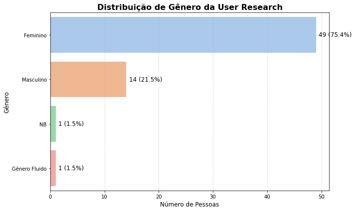

# User Research -  Central do Pet

## Pergunta 1: Qual seu gênero?

**Dados coletados:**

- Feminino: 49
- Masculino: 14
- NB: 1
- Gênero Fluido: 1

**Análise:**
A maioria dos respondentes é do gênero feminino, representando 77% dos participantes. O gênero masculino corresponde a 22%, enquanto NB (não-binário) e Gênero Fluido são representados por apenas 1 participante cada.

---

## Pergunta 2: Quantos animais de estimação você possui?

**Dados coletados:**

- 1: 32
- 2: 17
- 3 ou mais: 13

**Análise:**
A maior parte dos respondentes (53%) possui apenas um animal de estimação. Aqueles que possuem dois animais correspondem a 28%, e 19% possuem três ou mais animais.

---

## Pergunta 3: Qual tipo de animal de estimação você possui?

**Dados coletados:**

- Gato: 28
- Cachorro: 35
- Cachorro e Gatos: 2
- Gato e Cachorro: 1
- Gatos e Uma Cadela: 1
- Cachorro e Calopsita: 1
- Gato, Cachorros, Calopsitas e Periquitos: 1
- Galo e Galinha: 1
- Cigarra: 1

**Análise:**
Os dados mostram que os cães são os animais de estimação mais comuns entre os respondentes, representando 54% das respostas. Os gatos aparecem em segundo lugar com 43%. Outros tipos de combinações ou animais menos comuns representam uma porcentagem pequena, indicando uma preferência geral por cães e gatos.

---

## Pergunta 4: Com qual frequência você leva seu animal de estimação ao Veterinário?

**Dados coletados:**

- Apenas quando necessário: 48
- Frequentemente: 11
- Raramente: 3

**Análise:**
A maioria dos participantes (73%) leva seus animais de estimação ao veterinário apenas quando necessário. Cerca de 17% dos respondentes afirmaram visitar o veterinário frequentemente, enquanto 5% indicaram que fazem isso raramente.

---

## Pergunta 5: Atualmente, você utiliza algum aplicativo ou website que centraliza os exames, diagnósticos ou outras informações dos seus pets (animais domésticos)?

**Dados coletados:**

- Não, vou presencialmente à clinicas veterinárias e tenho algum tipo de laudo/carteirinha, etc.: 42
- Sim, utilizo: 6

**Análise:**
A maioria dos participantes (88%) ainda depende de métodos tradicionais, como ir presencialmente às clínicas veterinárias e possuir documentos físicos como laudos ou carteirinhas. Apenas 12% dos respondentes utilizam algum aplicativo ou website para centralizar as informações dos seus animais.

---

## Pergunta 6: Você gostaria de utilizar um aplicativo ou website que centralizasse as informações dos seus pets como laudos, exames, vacinas, etc.?

**Dados coletados:**

- Sim: 29
- Não: 9

**Análise:**
A maioria dos participantes (76%) demonstrou interesse em utilizar um aplicativo ou website para centralizar as informações dos seus pets, como laudos, exames e vacinas. Apenas 24% não têm interesse em utilizar esse tipo de serviço.

---

## Pergunta 7: Por favor, escreva o nome do aplicativo ou website que utiliza para verificar os dados dos seus pets, como por exemplo: Laudos, Diagnósticos, Carteirinha de Vacinação, etc.

**Dados coletados:**

- Petlove: 5
- Central Pet: 1
- Guardo na nuvem os exames digitais: 1

**Análise:**
A maioria dos participantes (83%) informou que utiliza o **Petlove** para acessar informações relacionadas aos seus pets, como laudos e diagnósticos. Apenas 17% mencionaram outros métodos, como **Central Pet** (provavelmente um erro) e **armazenamento na nuvem**. Isso sugere que o **Petlove** é a plataforma mais popular para os donos de pets no que diz respeito ao armazenamento e acesso às informações importantes de seus animais.

# Conclusão

O levantamento revelou informações úteis sobre o perfil dos respondentes e seus animais de estimação:

- Predominância de respondentes do gênero feminino.
- A maioria dos participantes possui apenas um animal de estimação.
- Os cães são ligeiramente mais populares que os gatos entre os tipos de animais de estimação.
- A maioria dos respondentes leva seus animais ao veterinário apenas quando necessário.
- A maioria ainda utiliza métodos tradicionais de registro das informações dos pets, como laudos e carteirinhas físicas.
- A maior parte dos participantes demonstrou interesse em utilizar um aplicativo ou website para centralizar as informações dos seus pets.

---